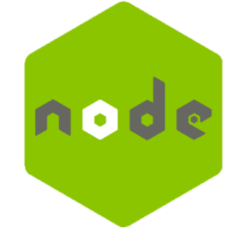

# 😊 Welcome
 

# 📂 Projects
||**Killing Floor 2**||
|-|:-|-|
||[Controlled Difficulty - Combined Edition](https://github.com/Asapi1020/CD-Combined-Edition)|The custom mode CD's Japanese version|
||[Escape Helper](https://github.com/Asapi1020/Escape-Helper)|A mutator to help enjoy the custom map "Escape Nightmares"|
||[Custom Weeklies](https://github.com/Asapi1020/Custom-Weeklies)|Custom weekly modes|
||[Zed Cosmetic Mod](https://github.com/Asapi1020/ZedCosmeticMut)|A mutator to force zeds to wear hats|
||[Damage Buffer](https://github.com/Asapi1020/DamagBuffer)|A mutator to test medic buff|
||[Skin Fit Mod](https://github.com/Asapi1020/SkinFitMod)|A game mode to try weapon skins via a freaking chat conversation system|
||[Mosinna](https://github.com/Asapi1020/Mosinna)|A game mode to enjoy Mosin Nagant|
||[Extended Endless](https://github.com/Asapi1020/Extended-Endless)|A custom endless mode with various additional contents|
||[Stats Displayer](https://github.com/Asapi1020/StatsDisplayer)|A mutator for offline to show player stats|
||**Python Scripts**||
||[Git KF Integrator](https://github.com/Asapi1020/Git-KF-Integrator)|Integrate Git management and KF mod compiling|
||[Discord Bot CD Recorder](https://github.com/Asapi1020/Discord-Bot-CDRecorder)|A discord bot with web scraping for CD records|
||[Weather News](https://github.com/Asapi1020/WeatherNews)|PySimpleGUI and Web Scraping tutorial|
||**Google Apps Script**||
||[KF2 some simulator](https://github.com/Asapi1020/KF2-some-simulator)|Simulate some KF2 system with Google Spreadsheets|
||[Schedule Manager](https://github.com/Asapi1020/Schedule-Manager)|Simple schedule manager with HTML page and spreadsheets|
||[Various Timer Project](https://github.com/Asapi1020/Various-Timer-Project)|Various programs referring online info and notify to discord|

# 📜 History
|Year|Skill|Comprehension|Description|
|-|:-|-|-|
|2019| Python|★★★|Learned in institute|
|2020| C++|★|Learned in institute|
|| MATLAB|★|Learned in institute|
|2021| **Unreal Script** |★★★★★|Learned by myself to develop game mods|
|| Linux with Ubuntu|★★★|Learned by myself to host game servers|
|2022| Web scraping|★★|Selenium, Beautiful Soup, Requests with Python|
|| PySimpleGUI|★|The simplest GUI library for Python|
|2023| Git|★★★★|Learned by myself|
|2024| Google Apps Script|★★★|Learned by myself|
|| HTML/CSS|★★★|Learned by myself|
|| Docker|★|Learned in company|
|| Node.js|★★★|Learned in company|
|| PostgreSQL|★|Learned in company|
|| Type Script|★★★|Learned in company|
|| AWS|★★|Learned in company|

# 🔗 Links

